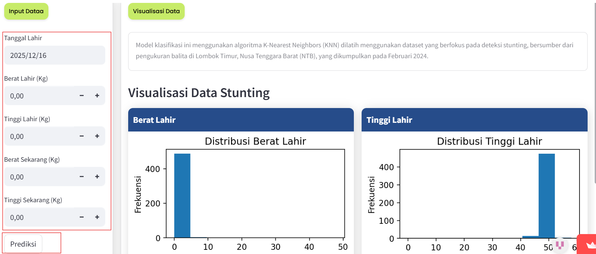
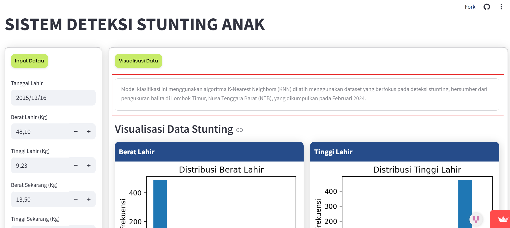
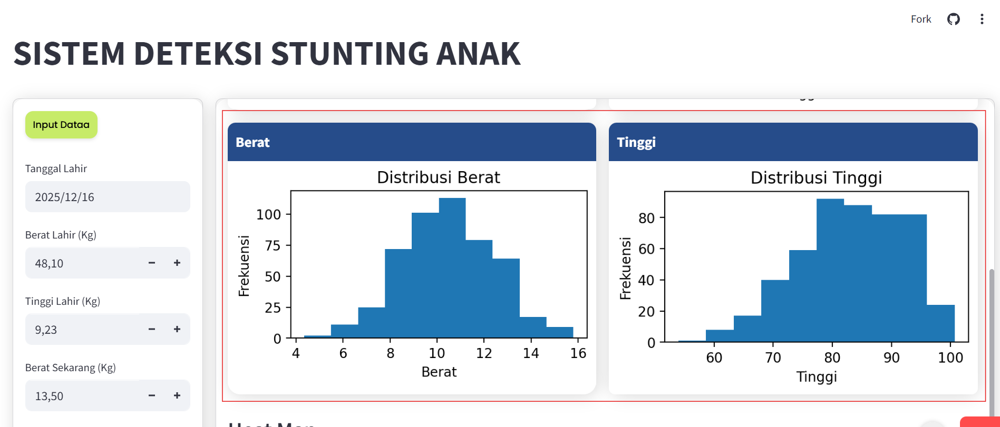
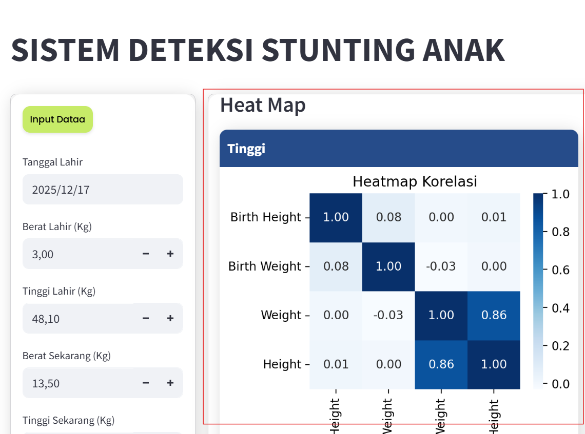
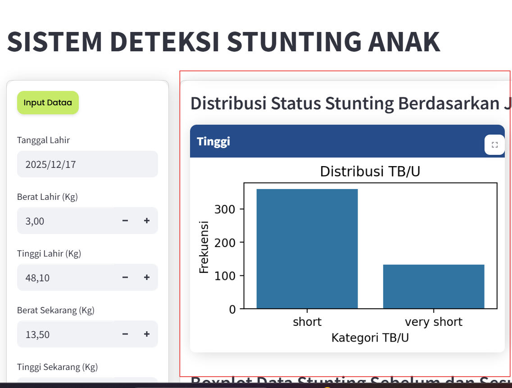
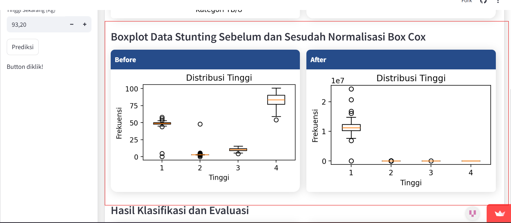
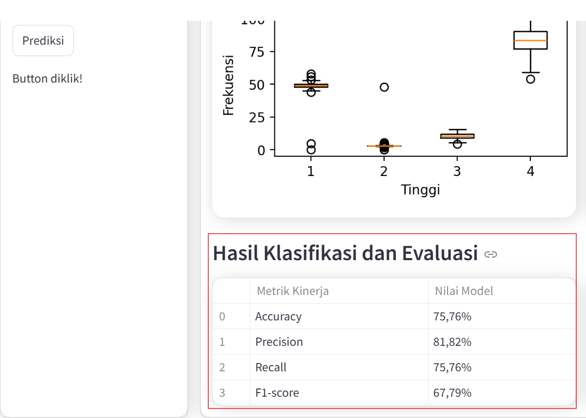

# klasifikasi Stunting Lombok Barat

Repositori ini berisi aplikasi **Sistem Deteksi Stunting Anak** yang digunakan untuk membantu proses analisis dan deteksi stunting pada balita. Aplikasi ini dilengkapi dengan fitur **input data anak**, **visualisasi data stunting**, serta **hasil analisis menggunakan metode machine learning**.

---

## 🚀 Langkah-Langkah Menjalankan Proyek

Ikuti urutan langkah berikut agar proyek ini bisa langsung dijalankan setelah clone.

---

### 1. Menjalankan dan Menggunakan Aplikasi

#### a. Membuka Aplikasi

Saat aplikasi dibuka, pengguna akan langsung melihat halaman utama dengan judul “Sistem Deteksi Stunting Anak”.
Tampilan aplikasi terbagi menjadi dua bagian utama:

- Sebelah kiri : Form input data anak

- Sebelah kanan : Visualisasi data dan hasil analisis

---

#### b. Mengisi Data Anak

Pada bagian Input Data, pengguna memasukkan data balita yang akan dianalisis, meliputi:

- Tanggal lahir anak

- Berat lahir

- Tinggi lahir

- Berat badan saat ini

- Tinggi badan saat ini

Setelah semua data diisi, pengguna menekan tombol Prediksi untuk memproses data anak tersebut.

#### c. Informasi Model dan Dataset

Sebelum menampilkan hasil analisis, aplikasi memberikan informasi singkat terkait model dan dataset yang digunakan, yaitu:

Sistem menggunakan model klasifikasi K-Nearest Neighbors (KNN)

Dataset berasal dari data pengukuran balita di Lombok Timur, Nusa Tenggara Barat (NTB) yang dikumpulkan pada Februari 2024

---

#### d. Visualisasi Data Stunting

Pengguna dapat melihat berbagai visualisasi untuk memahami karakteristik data stunting, antara lain:

Pengguna dapat melihat berbagai visualisasi untuk memahami karakteristik data stunting, antara lain:

Visualisasi yang ditampilkan meliputi grafik distribusi untuk:

Berat lahir

Tinggi lahir

Berat badan

Tinggi badan

Grafik ini membantu pengguna dalam memahami pola dan sebaran data anak secara umum.

---

#### e. Heatmap Korelasi

Aplikasi menampilkan **peta korelasi** antar variabel, antara lain:
- Berat lahir  
- Tinggi lahir  
- Berat badan  
- Tinggi badan  

Tujuan dari visualisasi ini adalah untuk menunjukkan hubungan antar variabel yang berpengaruh terhadap kondisi stunting.

---

#### f. Distribusi Status Stunting

Ditampilkan grafik jumlah anak berdasarkan kategori **TB/U (Tinggi Badan menurut Umur)**.  
Visualisasi ini memperlihatkan:
- Perbandingan jumlah anak normal dan stunting  
- Dominasi kategori tertentu dalam dataset  

---

#### g. Boxplot Sebelum dan Sesudah Normalisasi

Aplikasi membandingkan:
- Kondisi data **sebelum normalisasi**  
- Kondisi data **sesudah normalisasi Box-Cox**  

Tujuan dari tahap ini adalah untuk menunjukkan bahwa data menjadi lebih stabil dan siap digunakan dalam proses klasifikasi.

---

#### h. Hasil Klasifikasi dan Evaluasi Model

Pada bagian akhir, aplikasi menampilkan hasil evaluasi model klasifikasi dalam bentuk tabel yang berisi:
- Accuracy  
- Precision  
- Recall  
- F1-Score  

Nilai evaluasi tersebut menunjukkan seberapa baik model dalam mendeteksi status stunting pada anak.

---
